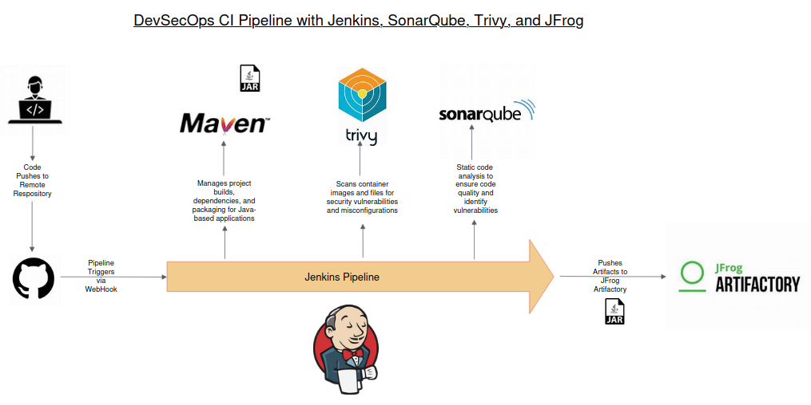

# DevSecOps CI Pipeline with Jenkins, SonarQube, Trivy and JFrog

 This project demonstrates how to automate the build, code quality analysis, and artifact management processes for a Java application using popular DevOps tools.




## What this repository includes

This repository is designed to showcase the integration of the following tools in a CI pipeline:

    1.1 Jenkins for automating builds.
    1.2 SonarQube for static code analysis.
    1.3 JFrog Artifactory for managing and storing build artifacts.

## Detailed Setup

For detailed step-by-step instructions on setting up the pipeline, configuring the tools, and running the project, please refer to the detailed README.md located in the README folder.

please refer to the [detailed README.md](./README/README.md) located in the `README` folder.


## Key Features

    1.1 Automated build using Maven.
    1.2 Static analysis of Java code for bugs, vulnerabilities, 
    1.3 Code smells via SonarQube.
    1.4 Secure and efficient artifact management with JFrog Artifactory.

# How to Use

1.1 Clone this repository:

```
git clone https://github.com/kapilkumaria/CI-pipeline-with-jenkins-sonarqube-and-jfrog.git
```

Follow the detailed instructions in the [detailed README.md](./README/README.md) for setting up and running the pipeline.

## License

This project is licensed under the MIT License - see the [LICENSE](./LICENSE) file for details.


## Attribution

This repository uses sample code from the [Jenkins Docs - Simple Java Maven App](https://github.com/jenkins-docs/simple-java-maven-app/tree/master) repository.

Special thanks to the Jenkins community for providing this example as a starting point for integrating Jenkins with Maven and other CI tools.
